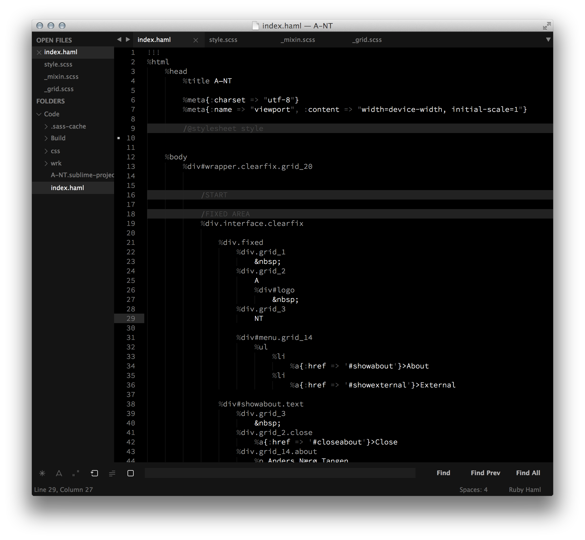

# Monospace

Custom UI themes for Sublime Text 2/3 modified from the Spacegray theme by Gadzhi Kharkharov and the Ublime color schemes.

*I recommend using the [__Source Code Pro__](https://github.com/adobe/Source-Code-Pro) font by Adobe.*

***

### Themes

Dark variation

Light variation

***

### Links
- The original Spacegray theme: http://kkga.github.io/spacegray
- Ublime color schemes: https://github.com/imagentleman/ublime